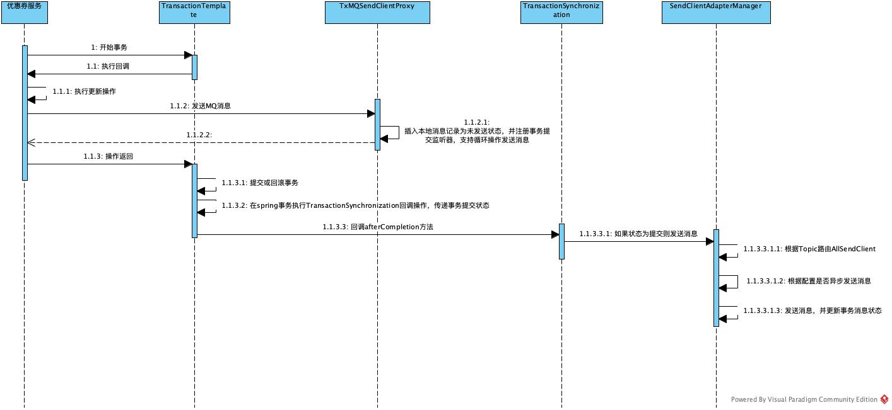
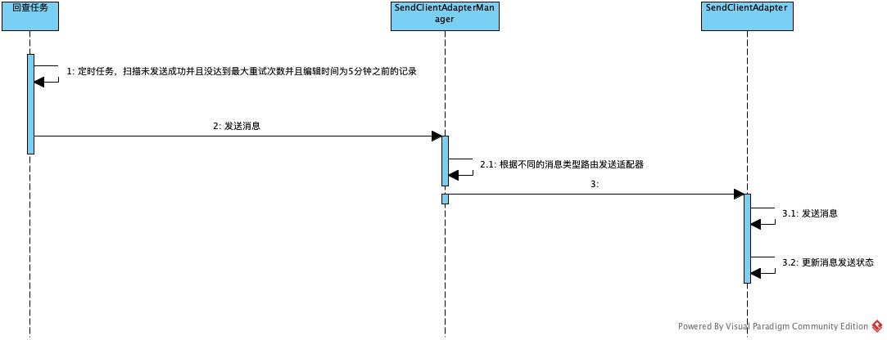
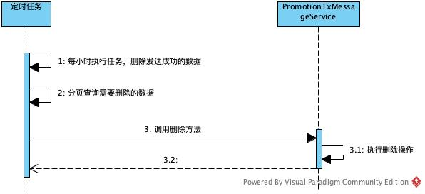
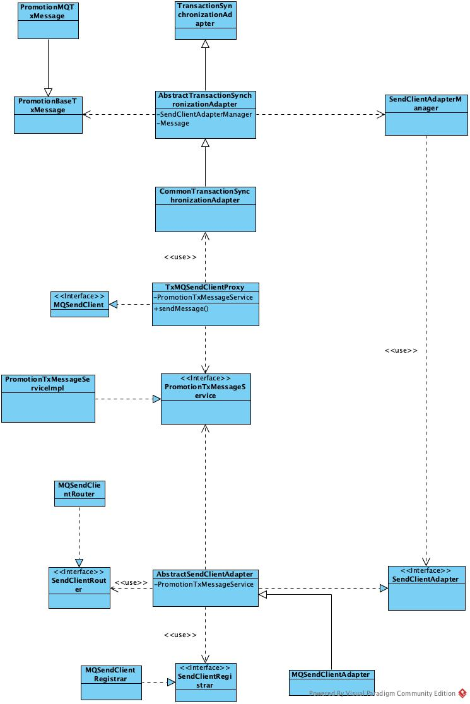

#事务消息工具

1. 功能

保证消息发送成功，通过本地消息表，做事务补偿

2. 扩展

接口实现了扩展，可自定义静态代理类，代理诸如短信和邮件发送，保证最终一致性

3. 测试类

TxMQSendClientProxyTest

4. 配置化

TxMessageDisconf通过disconf配置可自行替换
TxMessageRetryTask为事务补偿重试定时任务
TxMessageDeleteTask为删除成功消息定时任务，通过TOC，可自行替换

5. 流程图

发送消息

发送回查

删除已发送的数据

6. UML图

